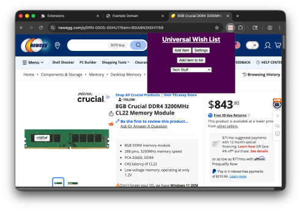

# Universal Wish List Chrome Extension

This is the Google Chrome extension for Universal Wish List, which allows you to add items to your wish lists without leaving the shopping website.

To add an item on the current website to a wish list, follow the [Installation](#installation) and [Set Up](#set-up) instructions and then just select a list from the dropdown menu and click **Add item to list**.

## Installation

*Instructions taken from the [Chrome Hello World tutorial](https://developer.chrome.com/docs/extensions/get-started/tutorial/hello-world#load-unpacked).*

1. Clone the repository with `git clone https://github.com/UniversalWishList/chrome-extension.git`.
2. Open Google Chrome and go to `chrome://extensions`.
3. Enable Developer Mode by toggling the switch next to **Developer mode**.
4. Click the **Load unpacked** button and select the directory where you cloned the repository.

The extension is now cloned, you can access it from the puzzle icon in the top right and, optionally, can pin it for easy access.

## Loading Changes

In `chrome://extensions` there is a reload button on the panel for this extension. Click it to reload the extension to match any changes made in this directory.

## Set Up

1. Follow the [instructions](https://github.com/UniversalWishList/wishlist#creating-an-api-key) in the wishlist repository to generate an API key. Save that API key somewhere safe.
2. Open the extension window by clicking its icon.
3. Click the **Settings** button.
4. Paste your API key into the **API key** field and click **Save API Key**
5. Paste the host address of the Wishlist application into the **Host address** field and click **Save Host Address**.
    - This should look like `http://[IP address of the host computer]:3280`.

## Dev Notes

- View the console log by opening the popup window, right clicking it and selecting **Inspect**. Then select the **Console** panel from the top.
- If there's an error, an **Error** button will show up in `chrome://extensions`. If you click it you can see details about the errors.

## Sources

- [Wishlist image logo, credits go to "cmintey/wishlist"](https://github.com/cmintey/wishlist/blob/main/src/lib/assets/logo.png)
- [Hello World extension | Get started | Chrome for Developers](https://developer.chrome.com/docs/extensions/get-started/tutorial/hello-world)
- [Permissions | Chrome for Developers](https://developer.chrome.com/docs/extensions/reference/permissions-list)
- [Message passing | Chrome for Developers](https://developer.chrome.com/docs/extensions/develop/concepts/messaging)
- [Handle events with service workers | Get started | Chrome for Developers](https://developer.chrome.com/docs/extensions/get-started/tutorial/service-worker-events)
